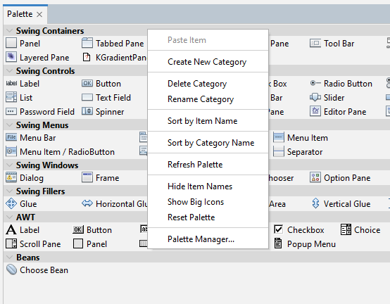
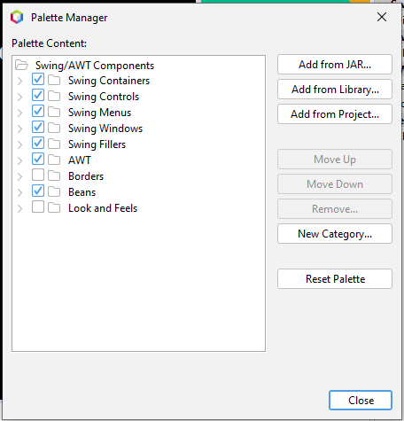
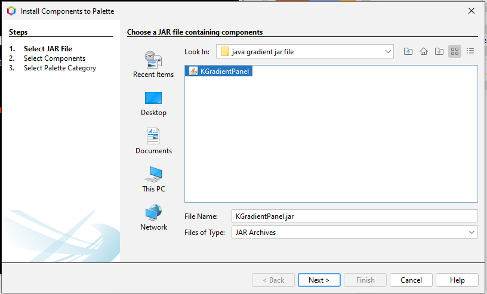

# Employee-HR-Connect

## Table of Contents

- [Overview](#overview)
  - [Built With](#built-with)
- [Features](#features)
- [How to use](#how-to-use)
- [Contact](#contact)
- [Acknowledgements](#acknowledgements)

## About
- It is a small project built in Java language. I named it "HR-Connect"
- Employee Management System in Java without MySQL
- To see the branding of the project follow the [website](https://sites.google.com/diu.edu.bd/devdeo/)

## How to Run
  - Install the NetBeans IDE in your system.
    - To install NetBeans, follow the [NetBeans Page](https://netbeans.apache.org/download/index.html).
  - Download and attach a Swing Container to your IDE.
    - First, follow the drive link to download the JAR file of [Swing Container](https://drive.google.com/drive/folders/1c5iezJzm83BrZXPWNOJHVgBjMGv_Fcof?usp=sharing)
    - Second follow the steps for intall the JAR file to the container.
      1. Right-click to the "Swing Container" and press the "Palette Manager" option.
      
      2. Click "Add from JAR" option to add the dowloaded JAR file to the container.
      
      4. Browse to the JAR file and install into the container.
       
  - Clone the project from my repository.
    - For the Cloning repository, follow the [GitHub Page](https://docs.github.com/en/repositories/creating-and-managing-repositories/cloning-a-repository)
  - Run the project and enjoy.

## Screenshots
### Login page

### Lading page

### Edit employee page

### New job page

### Paycheqe page

### Company information page

